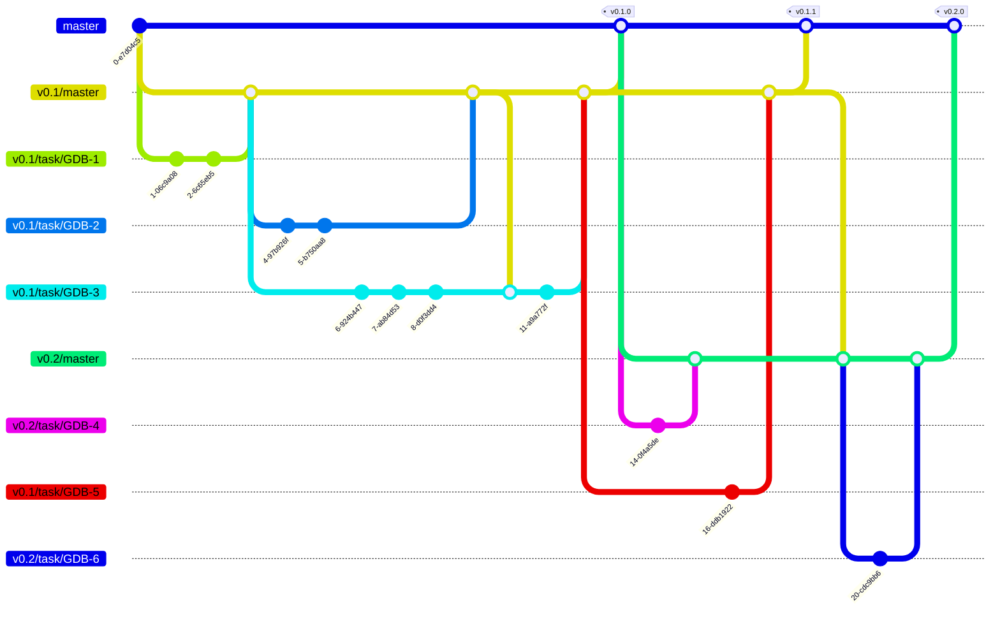

# Git Workflow

```mermaid
%%{init: { 'gitGraph': {'mainBranchName': 'master'}} }%%
    gitGraph
        commit
        branch v0.1/master
        branch v0.1/task/GDB-1
        commit
        commit
        checkout v0.1/master
        merge v0.1/task/GDB-1
        branch v0.1/task/GDB-2
        commit
        commit
        checkout v0.1/master
        branch v0.1/task/GDB-3
        commit
        commit
        commit
        checkout v0.1/master
        merge v0.1/task/GDB-2
        checkout v0.1/task/GDB-3
        merge v0.1/master
        commit
        checkout v0.1/master
        merge v0.1/task/GDB-3
        checkout master
        merge v0.1/master tag:"v0.1.0"
        branch v0.2/master
        branch v0.2/task/GDB-4
        commit
        checkout v0.2/master
        merge v0.2/task/GDB-4
        checkout v0.1/master
        branch v0.1/task/GDB-5
        commit
        checkout v0.1/master
        merge v0.1/task/GDB-5
        checkout master
        merge v0.1/master tag:"v0.1.1"
        checkout v0.2/master
        merge v0.1/master
        branch v0.2/task/GDB-6
        commit
        checkout v0.2/master
        merge v0.2/task/GDB-6
        checkout master
        merge v0.2/master tag:"v0.2.0"
```
