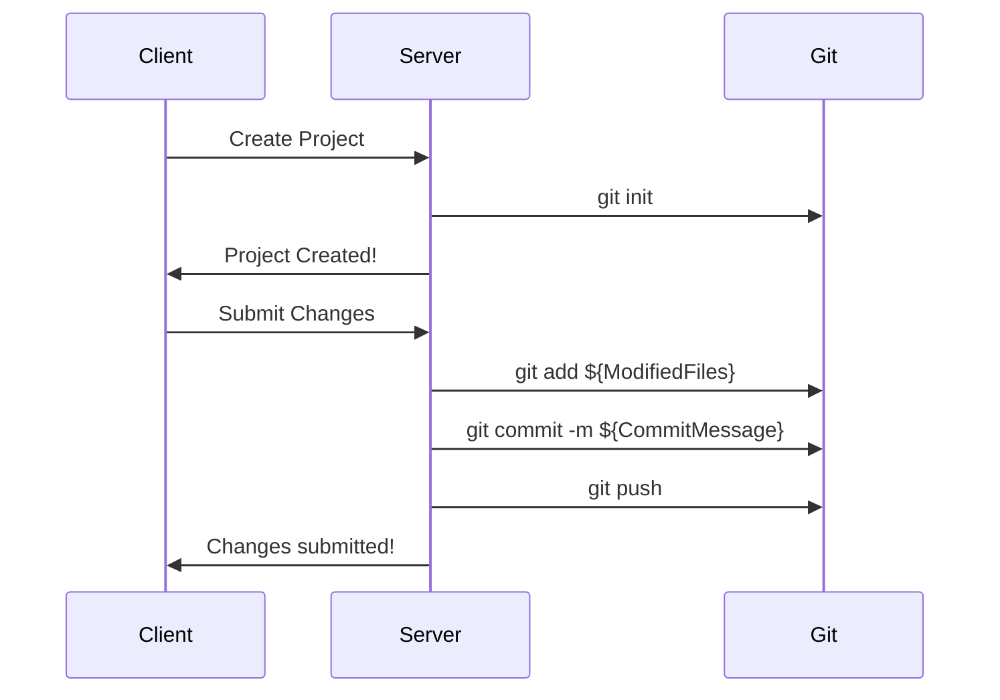

# High level workflow

```mermaid
sequenceDiagram
    Client->>Server: Create Project
    Server->>Git: git init
    Server->>Client: Project Created!
    Client->>Server: Submit Changes
    Server->>Git: git add ${ModifiedFiles}
    Server->>Git: git commit -m ${CommitMessage}
    Server->>Git: git push
    Server->>Client: Changes submitted!
```
