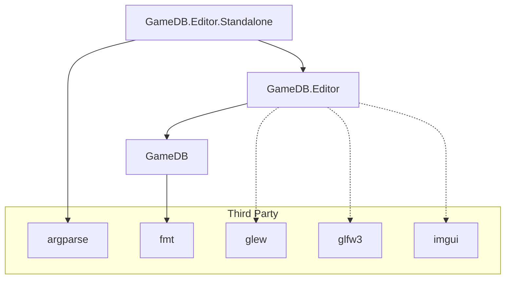

# Project Overview

## Dependency Graph

```mermaid
graph TD;
    subgraph Third Party
        argparse;
        fmt;
        glew
        glfw3
        imgui
    end

    GameDB --> fmt;
    GameDB.Editor --> GameDB;
    GameDB.Editor -.-> glew;
    GameDB.Editor -.-> glfw3;
    GameDB.Editor -.-> imgui;
    GameDB.Editor.Standalone --> GameDB.Editor;
    GameDB.Editor.Standalone --> argparse;
```

## GameDB

## GameDB.Editor

## GameDB.Editor.Standalone

## Third Party