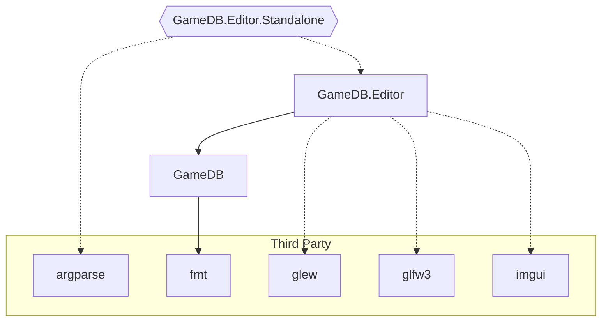
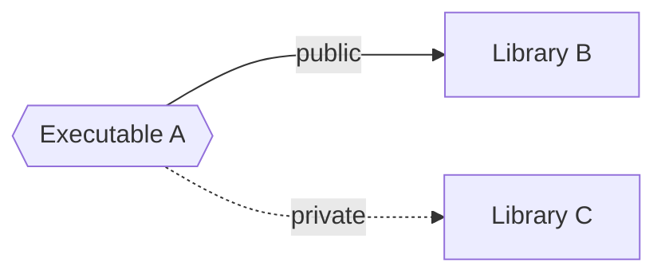

# Project Overview

## Dependency Graph

### Legend

## GameDB

## GameDB.Editor

## GameDB.Editor.Standalone

## Third Party

-   argparse <https://github.com/p-ranav/argparse>
-   fmt <https://github.com/fmtlib/fmt>
-   glew <https://github.com/nigels-com/glew>
-   glfw3 <https://github.com/glfw/glfw>
-   imgui <https://github.com/ocornut/imgui>
