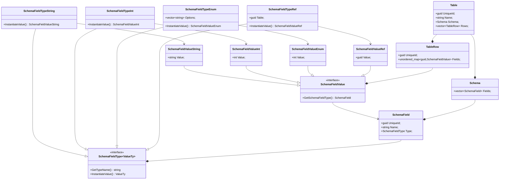

# Class Diagram

```mermaid
classDiagram
    class SchemaFieldValue {
        +GetSchemaFieldType() SchemaField
    }
    <<interface>> SchemaFieldValue
    SchemaFieldValue --> SchemaField

    class SchemaFieldType~ValueTy~ {
        +GetTypeName() string
        +InstantiateValue() ValueTy
    }
    <<interface>> SchemaFieldType

    class SchemaFieldValueString {
        +string Value;
    }
    SchemaFieldValueString --|> SchemaFieldValue
    
    class SchemaFieldTypeString {
        +InstantiateValue() SchemaFieldValueString
    }
    SchemaFieldTypeString --|> SchemaFieldType
    SchemaFieldTypeString --> SchemaFieldValueString

    class SchemaFieldValueInt {
        +int Value;
    }
    SchemaFieldValueInt --|> SchemaFieldValue

    class SchemaFieldTypeInt {
        +InstantiateValue() SchemaFieldValueInt
    }
    SchemaFieldTypeInt --|> SchemaFieldType
    SchemaFieldTypeInt --> SchemaFieldValueInt

    class SchemaFieldValueEnum {
        +int Value;
    }
    SchemaFieldValueEnum --|> SchemaFieldValue

    class SchemaFieldTypeEnum {
        +vector~string~ Options;
        +InstantiateValue() SchemaFieldValueEnum
    }
    SchemaFieldTypeEnum --|> SchemaFieldType
    SchemaFieldTypeEnum --> SchemaFieldValueEnum

    class SchemaFieldValueRef {
        +guid Value;
    }
    SchemaFieldValueRef --|> SchemaFieldValue

    class SchemaFieldTypeRef {
        +guid Table;
        +InstantiateValue() SchemaFieldValueRef
    }
    SchemaFieldTypeRef --|> SchemaFieldType
    SchemaFieldTypeRef --> SchemaFieldValueRef

    class SchemaField {
        +guid UniqueId;
        +string Name;
        +SchemaFieldType Type;
    }
    SchemaField --* SchemaFieldType

    class Schema {
        +vector~SchemaField~ Fields;
    }
    Schema --* SchemaField

    class TableRow {
        +guid UniqueId;
        +unordered_map~guid,SchemaFieldValue~ Fields;
    }
    TableRow --* SchemaFieldValue

    class Table {
        +guid UniqueId;
        +string Name;
        +Schema Schema;
        +vector~TableRow~ Rows;
    }
    Table --* Schema
    Table --* TableRow
```