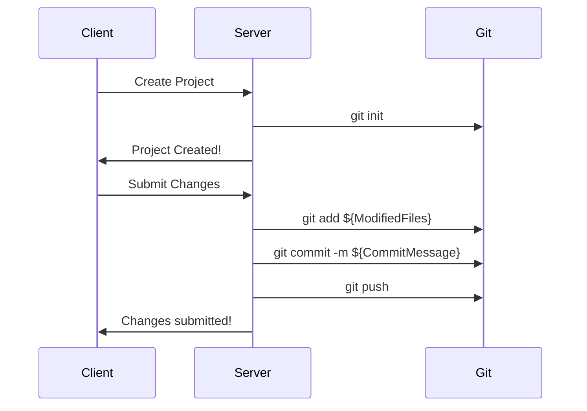

# GameDB

## Roadmap

### 0.1.0 (MVP Validation)

-   [ ] Create Project
-   [ ] Checkout Project
-   [ ] Create Schema (String Fields Only)
-   [ ] Create Rows
-   [ ] Submit Changes 
-   [ ] Diff Preview
-   [ ] Revert Changes
-   [ ] Publish Project (Local JSON file Only)

### 1.0.0

-   [ ] Create more field types for schemas. (Int, Float, Bool, Enum, Ref)
-   [ ] Table search (Fuzzy)
-   [ ] User Roles (Read Only, Read/Write)

### 1.1.0

-   [ ] Create Branch
-   [ ] Merge Branches 
-   [ ] Diff Branches 
-   [ ] Schema Field Data Validation (Regex, Comparison and Logical Operators)

### 1.2.0

-   [ ] Lock Schema
-   [ ] Lock Schema Field
-   [ ] Lock Schema Table
-   [ ] Lock Schema Table Row
-   [ ] Lock Schema Table Column

### 1.3.0

-   [ ] User Roles Per Schema
-   [ ] Table search (Per Schema field)

### 1.4.0

-   [ ] Schema Table Cell Formula Support
-   [ ] Create Changes Review
-   [ ] Approve Changes Review

## High level workflow

